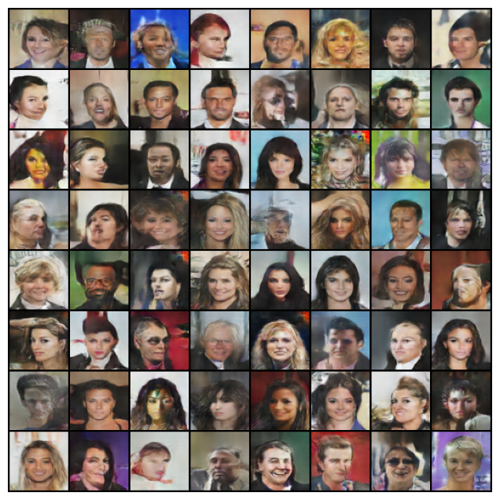
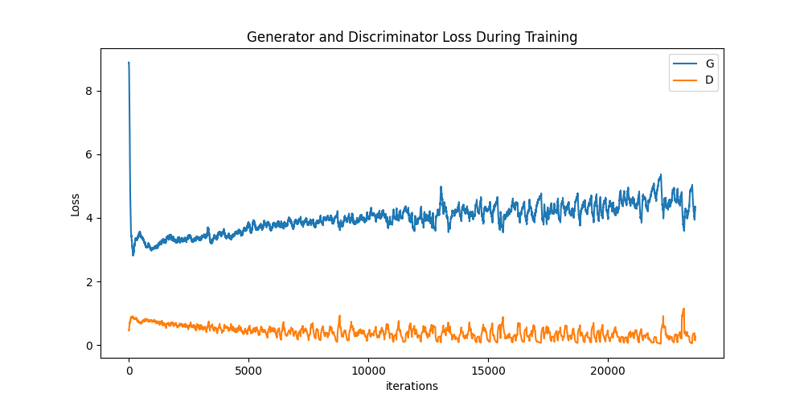

# ✨ FaceForge AI

> **Transform random noise into photorealistic human faces with the power of deep learning**


## 🔮 Overview

FaceForge AI harnesses the cutting-edge Deep Convolutional Generative Adversarial Network (DCGAN) architecture to create stunning, lifelike human faces that don't actually exist. Built with PyTorch and trained on the massive CelebA dataset (202,599 celebrity images), this implementation offers both impressive results and exceptional flexibility.

## ✨ Key Features

- **State-of-the-art Implementation** — Leverages PyTorch's dynamic computation graph for optimal training
- **Architectural Excellence** — Clean, modular codebase designed for experimentation and extension
- **Dataset Agnostic** — Easily train on your own custom image collections
- **Visual Progress Tracking** — Watch your model evolve through automatically saved samples
- **Production Ready** — Thoroughly tested components ready for research or commercial applications

## 📸 The Magic in Action

_From random noise to photorealistic faces in seconds:_



_Each training session automatically documents the model's creative journey in the `saved_images/` directory._

## 🏗️ Architecture

```
.
├── config.py                # Configuration hub (image size, paths, hyperparameters)
├── dataset.py               # Data pipeline optimization
├── models.py                # Generator & Discriminator neural architectures
├── train.py                 # Training orchestration
├── utils.py                 # Helper functions for visualization & persistence
├── saved_images/            # Generated masterpieces
└── requirements.txt         # Environment dependencies
```

## 🚀 Quickstart Guide

### Step 1: Clone the Repository

```bash
git clone https://github.com/manohar3000/DCGAN.git
cd DCGAN
```

### Step 2: Set Up Your Environment

```bash
pip install -r requirements.txt
```

### Step 3: Acquire the CelebA Dataset

- Download the **img_align_celeba** dataset from [the official source](https://mmlab.ie.cuhk.edu.hk/projects/CelebA.html)
- Extract and place in your preferred location
- Update `DATASET_PATH` in `config.py` accordingly

### Step 4: Unleash the AI

```bash
python train.py
```

## 🎨 Train on Your Own Images

FaceForge AI welcomes your creative direction:

1. Organize your images in a dedicated folder
2. Update the configuration:
   ```python
   DATASET_PATH = "path/to/your_creative_dataset/"
   ```
3. Launch training with `python train.py`

_Note: Images will be automatically processed to 64×64 pixels._

## ⚙️ Fine-Tune Your Creation

Customize your generative experience by adjusting these parameters in `config.py`:

```python
BATCH_SIZE = 128      # Training batch size
IMAGE_SIZE = 64       # Output resolution
Z_DIM = 100           # Latent space dimensionality
NUM_EPOCHS = 5        # Training duration
LEARNING_RATE = 0.0002  # Optimization step size
DATASET_PATH = "D:/img_align_celeba"  # Data source
DEVICE = "cuda"       # Hardware acceleration (or "cpu")
```

## 📊 Training Insights



The training process offers:
- Real-time loss metrics for both Generator and Discriminator
- Visual samples at configurable intervals
- Intuitive progression tracking to fine-tune your results

## 🔧 Troubleshooting Excellence

| Issue | Solution |
|-------|----------|
| **CUDA errors** | Training automatically falls back to CPU if GPU is unavailable |
| **Image quality issues** | Extend training duration - GAN quality improves over time |
| **Memory constraints** | Reduce `BATCH_SIZE` in `config.py` for lower memory footprint |

## 🌟 Contribute

Join our community of AI artists and engineers! We welcome contributions that:

- Implement innovative architectures
- Enhance training stability and efficiency
- Expand dataset compatibility
- Improve visualization capabilities

## 🙏 Acknowledgments

- **Architecture**: Inspired by the groundbreaking work of Radford et al. (2016)
- **Data**: Powered by the diverse CelebFaces Attributes (CelebA) dataset

## 📄 License

Released under the MIT License, empowering you to create without constraints.

---

<div align="center">
<i>Bridging the gap between random noise and creative reality</i>
</div>
